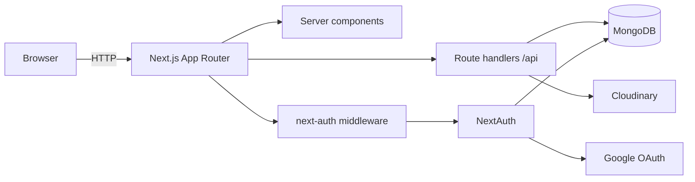

# HomeHaven — Technical README

Production-oriented documentation for this repository only. Uncertain items are labeled **Assumption**; gaps are stated explicitly.

---

## What the app does

- **Public:** Browse rental-style property listings, search by location text and optional type, view detail pages (maps via Leaflet).
- **Signed-in users:** Add and edit their own listings (images uploaded to Cloudinary), delete owned listings, bookmark properties, view saved bookmarks, see messages where they are the **recipient**, send contact messages tied to a property and recipient.

---

## Architecture

- **Monolith:** Single Next.js 14 app (App Router). No separate API service.
- **Rendering:** Mix of React Server Components (RSC) and client components (`'use client'`). Root `app/layout.jsx` wraps the tree with NextAuth `SessionProvider` (`components/AuthProvider.jsx`), global styles, navbar, footer, toasts.
- **Data:** MongoDB accessed only from **Route Handlers** (`app/api/**`) and auth callbacks via Mongoose. `config/database.js` caches the Mongoose connection on `global` for reuse across invocations (typical for serverless).
- **External:** Google OAuth (NextAuth), Cloudinary (listing images).



---

## Folder structure

```
app/
  layout.jsx, loading.jsx, not-found.jsx
  page.jsx                    # Home
  login/page.jsx
  profile/page.jsx
  messages/page.jsx           # (+ page_old.jsx — legacy duplicate)
  properties/
    page.jsx                  # All listings
    add/page.jsx
    saved/page.jsx
    search-results/page.jsx
    [id]/page.jsx, [id]/edit/page.jsx
  api/
    auth/[...nextauth]/route.js
    properties/route.js, [id]/route.js, search/route.js, user/[userId]/route.js
    bookmarks/route.js, bookmarks/check/route.js
    messages/route.js, messages/[id]/route.js
components/                   # UI: forms, cards, Navbar, Footer, etc.
config/
  database.js                 # Mongoose connect + cache
  cloudinary.js               # SDK config from env
models/                       # User, Property, Message schemas
utils/
  authOptions.js              # NextAuth config
  getSessionUser.js           # Server session helper
  requests.js                 # Server/client fetch helpers
data/properties.json          # Sample-shaped data; not imported by runtime code
middleware.js                 # Re-exports next-auth/middleware + matcher
__tests__/api/                # Jest tests for selected route handlers
.github/workflows/ci.yml      # Lint + test on push/PR
```

Path alias: `@/*` → repository root (`jsconfig.json`).

---

## Local setup

**Requirements (observed from `package.json` and CI):** Node **20** is used in CI; Next 14 and React 18 — use Node 18+ at minimum, 20 recommended.

```bash
git clone <repository-url>
cd property-pulse
npm install
cp .env.example .env.local   # create .env.local if .env.example exists; else create .env.local manually
```

Configure MongoDB (Atlas or local), Google OAuth web client, Cloudinary, and env vars (see below). Then:

```bash
npm run dev
```

Application default: [http://localhost:3000](http://localhost:3000).

Other commands:

```bash
npm run build
npm start
npm run lint
npm test
npm run test:watch
npm run test:coverage
```

**Assumption:** You will create Google OAuth redirect URI `http://localhost:3000/api/auth/callback/google` and allow that origin in Google Cloud Console.

---

## Environment variables

| Variable                                   | Used where                              | Purpose                                                                                                 |
| ------------------------------------------ | --------------------------------------- | ------------------------------------------------------------------------------------------------------- |
| `MONGO_URI`                                | `config/database.js`                    | Mongoose connection string                                                                              |
| `NEXTAUTH_SECRET`                          | `utils/authOptions.js`                  | NextAuth signing/encryption                                                                             |
| `GOOGLE_CLIENT_ID`, `GOOGLE_CLIENT_SECRET` | `utils/authOptions.js`                  | Google provider                                                                                         |
| `NEXT_AUTH_URL_INTERNAL`                   | `utils/authOptions.js`                  | Base URL concatenated for Google `callbackUrl`                                                          |
| `NEXT_AUTH_URL`                            | `app/api/properties/route.js`           | `Response.redirect` after `POST` create property                                                        |
| `CLOUDINARY_*`                             | `config/cloudinary.js`                  | Image uploads                                                                                           |
| `NEXT_PUBLIC_API_DOMAIN`                   | `utils/requests.js`                     | Full origin + `/api` for server-side `fetch` from RSC (e.g. `http://localhost:3000/api`)                |
| `NEXT_PUBLIC_DOMAIN`                       | `components/ShareButton.jsx`            | Absolute share URLs                                                                                     |
| `OPENAI_API_KEY`                           | `utils/ai/generatePropertyAIContent.js` | Required for AI description generation. If unset the endpoint returns `500 AI_PROVIDER_NOT_CONFIGURED`. |
| `OPENAI_MODEL`                             | `utils/ai/generatePropertyAIContent.js` | Optional. OpenAI model name. Defaults to `gpt-4o-mini`.                                                 |

**Repository gap:** NextAuth’s conventional `NEXTAUTH_URL` is **not** referenced in code; some hosts/docs expect it. This project relies on `NEXT_AUTH_URL_INTERNAL` / `NEXT_AUTH_URL` instead — align these with your real public origin in production.

**Risk:** If `NEXT_PUBLIC_API_DOMAIN` is unset, `fetchProperties` / `fetchProperty` / `fetchUserProperties` return `[]` / `null` / `[]` silently (`utils/requests.js`).

---

## Frontend

- **Router:** Next.js App Router; pages under `app/**/page.jsx`.
- **Styling:** Tailwind (`tailwind.config.js`, `postcss.config.js`), global CSS under `assets/styles/globals.css`.
- **Session (client):** `next-auth/react` inside components wrapped by `SessionProvider`.
- **Data loading:** Many listing views depend on `utils/requests.js` server helpers hitting `NEXT_PUBLIC_API_DOMAIN` + `/properties` paths. Search uses a **relative** fetch to `/api/properties/search?...`.
- **Images:** `next.config.mjs` `images.remotePatterns` for `lh3.googleusercontent.com` and `res.cloudinary.com`.
- **Maps:** `leaflet` / `react-leaflet` on relevant pages/components.

**Assumption:** `NEXT_PUBLIC_*` values are baked at **build time** on typical Next deployments; changing them requires a rebuild.

---

## Backend

- **Implementation:** App Router **Route Handlers** (`export async function GET|POST|PUT|DELETE`).
- **DB:** Every handler that needs data calls `await connectDB()` first.
- **Auth for mutations:** Handlers use `getSessionUser()` from `utils/getSessionUser.js` (`getServerSession(authOptions)`), then compare `userId` to resource ownership where implemented.

**Notable gap:** `GET /api/properties/user/[userId]` returns any user’s listings by ID **without** verifying the caller is that user (or an admin). Any client that can reach the API can enumerate another user’s property IDs if known. **Treat as an authorization gap** unless front-end-only access was intentional.

---

## Authentication and authorization

### Provider and config

- **NextAuth v4** with **Google** only (`utils/authOptions.js`).
- `callbackUrl` is set to `process.env.NEXT_AUTH_URL_INTERNAL + '/api/auth/callback/google'` (must match Google Console redirect URIs).
- `debug: true` and `secureCookie: true` are set globally in this file — see **Security** and **Observability**.

### Sign-in flow (as implemented)

1. User signs in with Google via NextAuth.
2. `signIn` callback: `connectDB()`, find `User` by `profile.email`.
3. If missing, `User.create({ name, email, image, username })` — **note:** `models/User.js` has no `name` field; Mongoose strict mode typically **drops** `name` (not persisted).
4. Callback return: existing users → `true`; new user path returns the created document object instead of `true`. **Risk:** NextAuth expects `boolean` or redirect URL; returning a model instance may be fragile across NextAuth versions (behavior not verified here).

### Session flow

1. `session` callback: loads `User` by `session.user.email`, sets `session.user.id = user._id.toString()`.
2. **Risk:** If no DB user exists for that email, `user` is `null` and `user._id` will throw — **Assumption:** this is rare if `signIn` always creates users first.

### Route protection (middleware)

- `middleware.js` exports default from `next-auth/middleware`.
- `config.matcher`: `/properties/add`, `/properties/saved`, `/profile`, `/messages`.
- Unauthenticated users hitting matched paths are redirected by NextAuth (default sign-in page behavior).

**Gap:** Middleware does **not** cover `/properties/[id]/edit` in the matcher array; protection for edit relies on API/UI behavior, not this middleware line.

### API-level authorization (partial inventory)

| Area                                  | Check                                |
| ------------------------------------- | ------------------------------------ |
| `POST /api/properties`                | Requires session                     |
| `PUT` / `DELETE /api/properties/[id]` | Requires session + owner match       |
| `GET/POST /api/bookmarks`             | Requires session                     |
| `POST /api/bookmarks/check`           | Requires session                     |
| `GET/POST /api/messages`              | Requires session (but see bug below) |
| `DELETE /api/messages/[id]`           | Requires session + recipient match   |
| `GET /api/properties/user/[userId]`   | **No session check in code**         |

---

## Database and schema

**Engine:** MongoDB via **Mongoose** (`mongodb`, `mongoose` dependencies).

### `User` (`models/User.js`)

| Field                    | Type                  | Notes                                 |
| ------------------------ | --------------------- | ------------------------------------- |
| `email`                  | String                | required, unique                      |
| `username`               | String                | required, unique                      |
| `image`                  | String                | default Cloudinary default avatar URL |
| `bookmarks`              | [ObjectId → Property] |                                       |
| `createdAt`, `updatedAt` | Date                  | `timestamps: true`                    |

### `Property` (`models/Property.js`)

| Field                          | Type                             | Notes                                     |
| ------------------------------ | -------------------------------- | ----------------------------------------- |
| `owner`                        | ObjectId → User                  | required                                  |
| `name`, `type`                 | String                           | required                                  |
| `description`                  | String                           | optional                                  |
| `location`                     | { street, city, state, zipcode } | subdocs, not all required at schema level |
| `beds`, `baths`, `square_feet` | Number                           | required                                  |
| `amenities`                    | [String]                         |                                           |
| `rates`                        | { nightly, monthly, weekly }     | optional numbers                          |
| `seller_info`                  | { name, phone, email }           | optional                                  |
| `images`                       | [String]                         | URLs                                      |
| `is_featured`                  | Boolean                          | default false                             |
| `createdAt`, `updatedAt`       | Date                             |                                           |

### `Message` (`models/Message.js`)

| Field                    | Type                | Notes                                                                     |
| ------------------------ | ------------------- | ------------------------------------------------------------------------- |
| `sender`, `recipient`    | ObjectId → User     | required                                                                  |
| `property`               | ObjectId → Property | required                                                                  |
| `name`, `email`          | String              | required                                                                  |
| `phone`, `body`          | String              | phone/body optional in practice unless Mongoose validation fails on empty |
| `read`                   | Boolean             | default false                                                             |
| `createdAt`, `updatedAt` | Date                |                                                                           |

**Indexes:** Only uniqueness on `User.email` and `User.username` is declared in schema. **No explicit compound indexes** for search queries (e.g. `location.city`, `type`) — performance at scale is **unknown** without profiling.

---

## API design

REST-style JSON for most routes; **exceptions:**

- `POST /api/properties` — `multipart/form-data`, responds with **redirect** to property page (not JSON).
- `PUT /api/properties/[id]` — `multipart/form-data`, JSON body of updated document in response.

**Inconsistencies (factual):**

- `GET /api/properties/[id]` sets `Content-Type: text/plain` while body is `JSON.stringify(property)` — clients may mis-parse.
- Errors mix plain strings and JSON objects; status codes are mostly `401` / `404` / `400` / `500` without a single envelope shape.

**Search:** `GET /api/properties/search?location=&propertyType=` builds a Mongo `$or` of regex matches across name, description, and location fields; optional `type` filter. **Risk:** User-controlled regex in `RegExp(location, 'i')` — special characters can affect performance or behavior (ReDoS **possible** if input unbounded; not analyzed in depth here).

---

## Validation and error handling

- **Input validation:** No shared Zod/Yup/Joi layer in the repo. Reliance is on **Mongoose schema** constraints and ad hoc checks (e.g. `POST /api/messages` blocks `user.id === recipient`).
- **Try/catch:** Route handlers generally wrap logic in `try/catch`, log with `console.log`, return generic 500s.
- **Client:** Forms use try/catch and toasts in several components; behavior varies by screen.

**Confirmed bug in repo:** `GET /api/messages` calls `const { userId } = sessionUser` **before** checking `sessionUser` for null, so unauthenticated requests can **throw** and hit the catch block instead of returning the intended 401 JSON.

**Other risks:**

- `POST /api/bookmarks/check`: if `User.findOne` returns `null`, `user.bookmarks` will throw.
- `POST /api/properties` image loop contains nested `Promise.all` usage that may not match intent (possible duplicate/wasteful uploads) — worth code review before treating as production-safe.

---

## Security

**What exists**

- HTTPS **Assumption** in production (operator responsibility).
- Secrets via env vars (not committed if `.env.local` is gitignored).
- NextAuth session for privileged routes; owner checks on property mutate/delete.
- Google OAuth for identity.

**Gaps and risks**

- `GET /api/properties/user/[userId]` — no auth check (see above).
- Search endpoint — unauthenticated regex query surface.
- `authOptions.debug: true` — may leak sensitive diagnostics in production if not overridden by environment.
- No rate limiting, CSRF beyond NextAuth defaults for OAuth, no CSP headers defined in repo.
- Session callback DB lookup on every session resolution — acceptable at small scale; caching not implemented.
- `secureCookie: true` can break local **HTTP** dev cookies in some setups — **Assumption:** dev uses `localhost` exception behavior or HTTPS tunnel.

---

## Testing

- **Runner:** Jest with `next/jest` (`jest.config.js`), `testEnvironment: 'node'`, `@/` mapped to repo root.
- **Setup:** `jest.setup.js` loads `@testing-library/jest-dom` (minimal use in current API tests).
- **Coverage:** `__tests__/api/messages.route.test.js` — `POST /api/messages` (401, 400 self-message, success). `__tests__/api/property-id.route.test.js` — `GET` and `DELETE` for `/api/properties/[id]` partial flows.
- **Not covered in tests:** Most routes, components, middleware, auth callbacks, Cloudinary, integration/E2E.

**CI:** `.github/workflows/ci.yml` runs `npm ci`, `npm run lint`, `npm test -- --runInBand` on `push`/`pull_request` (branches `main`/`master` for push). **Does not run `npm run build`.**

Commands:

```bash
npm test
npm test -- --runInBand
npm run test:coverage
```

---

## Deployment

**No Dockerfile** in repository; **Assumption:** target is a Node-compatible Next host (e.g. Vercel, Railway, Render, custom Node server).

**Checklist (operator)**

1. Set all env vars on the hosting provider; rebuild after changing `NEXT_PUBLIC_*`.
2. MongoDB Atlas: allow outbound from host IPs or `0.0.0.0/0` (understand tradeoff), use strong credentials.
3. Google OAuth: production redirect URI `https://<domain>/api/auth/callback/google`.
4. Align `NEXT_AUTH_URL_INTERNAL` and `NEXT_AUTH_URL` with public `https` origin.
5. Set `NEXT_PUBLIC_API_DOMAIN` to `https://<domain>/api` for RSC fetches.
6. Set `NEXT_PUBLIC_DOMAIN` for share links.
7. Consider turning off NextAuth `debug` in production.
8. **Assumption:** If using Vercel serverless functions, Mongoose connection caching in `config/database.js` is appropriate; long-lived TCP to Mongo is managed per invocation limits of the platform.

**Missing in repo:** `vercel.json`, production logging integration, health check route, migration/seed scripts for Mongo.

---

## Observability

- **Logging:** `console.log` / `console.error` scattered in handlers and `getSessionUser`; no structured logger, no correlation IDs.
- **APM / tracing:** Not present in dependencies or config.
- **Metrics:** Not present.

**Assumption:** Production monitoring is entirely external (host logs, Vercel dashboard, etc.) unless you add instrumentation.

---

## Troubleshooting

| Symptom                                | Likely cause in this repo                                     |
| -------------------------------------- | ------------------------------------------------------------- |
| Empty listings on home/all properties  | `NEXT_PUBLIC_API_DOMAIN` unset or wrong (must include `/api`) |
| Google redirect mismatch               | `NEXT_AUTH_URL_INTERNAL` / Console redirect URI mismatch      |
| Redirect after add property wrong host | `NEXT_AUTH_URL` wrong or http vs https                        |
| Images fail                            | Cloudinary env missing or invalid                             |
| Mongo errors on cold start             | `MONGO_URI` wrong; Atlas network allowlist                    |
| Session missing `user.id`              | User missing in DB for email; `session` callback error        |
| 500 on messages inbox when logged out  | `GET /api/messages` null-destructure bug                      |
| Edit page reachable without middleware | `middleware.js` matcher omits `/properties/[id]/edit`         |

---

## AI content generation

The Add Property form includes an optional "Generate description" helper that calls OpenAI to produce a listing title and short description from the property details already entered in the form.

### Required environment variable

| Variable         | Purpose                                               |
| ---------------- | ----------------------------------------------------- |
| `OPENAI_API_KEY` | Server-side API key for OpenAI. **Required.**         |
| `OPENAI_MODEL`   | Model override. Optional — defaults to `gpt-4o-mini`. |

### Endpoint

```
POST /api/properties/ai-content
```

- Requires an authenticated session (NextAuth). Returns `401` if unauthenticated.
- Server-side only — the API key is never exposed to the client.

### Request body (JSON)

| Field          | Type     | Required | Notes                                    |
| -------------- | -------- | -------- | ---------------------------------------- |
| `propertyType` | string   | yes      | e.g. `"Apartment"`                       |
| `location`     | string   | yes      | e.g. `"Austin, TX"`                      |
| `beds`         | number   | yes      | Must be ≥ 0                              |
| `baths`        | number   | yes      | Must be ≥ 0                              |
| `amenities`    | string[] | yes      | Can be empty array; max 30 items         |
| `rawNotes`     | string   | no       | Optional user hints; max 1200 characters |

### Success response `200`

```json
{
  "success": true,
  "data": {
    "title": "...",
    "shortDescription": "..."
  }
}
```

### Error response shape

```json
{
  "success": false,
  "error": {
    "code": "UNAUTHORIZED | INVALID_REQUEST | AI_PROVIDER_NOT_CONFIGURED | AI_PROVIDER_ERROR | AI_INVALID_RESPONSE | INTERNAL_ERROR",
    "message": "..."
  }
}
```

| Code                         | Status | Meaning                                                                     |
| ---------------------------- | ------ | --------------------------------------------------------------------------- |
| `UNAUTHORIZED`               | 401    | No valid session                                                            |
| `INVALID_REQUEST`            | 400    | Malformed JSON body or failed field validation                              |
| `AI_PROVIDER_NOT_CONFIGURED` | 500    | `OPENAI_API_KEY` is not set                                                 |
| `AI_PROVIDER_ERROR`          | 502    | OpenAI request failed (network error or non-OK HTTP response)               |
| `AI_INVALID_RESPONSE`        | 502    | OpenAI returned a response that could not be parsed into the expected shape |
| `INTERNAL_ERROR`             | 500    | Unexpected server error                                                     |

---

## Future improvements

Suggested from code review (not implemented):

- Fix `GET /api/messages` auth guard order; null-safe `User` in `bookmarks/check`.
- Add authorization to `GET /api/properties/user/[userId]` or remove ID from URL and use session only.
- Align `signIn` callback return value with NextAuth contract; add `name` to `User` schema or stop passing it.
- Normalize API error shape and `Content-Type` headers; fix `GET /api/properties/[id]` header.
- Input validation library + sanitization for search (escape regex or use text index).
- Rate limiting on public search and message POST.
- `npm run build` in CI; optional E2E (Playwright).
- Turn off `debug: true` for production via env.
- Remove or archive `app/messages/page_old.jsx` if unused.
- Review `POST /api/properties` image upload loop for correctness and size limits.

---

## Notes

### Assumptions

- Production runs behind HTTPS with env vars configured on the host.
- Operators use MongoDB Atlas or equivalent with network access compatible with the deployment region.
- Node 20 matches CI for local parity.

### Missing or incomplete repository information

- No committed runtime documentation beyond this file and the shorter `README.md`.
- No `.env.example` is guaranteed on every clone — **Assumption:** `.env.example` exists from prior work; if not, create from the env table above.
- NextAuth `signIn` return value and `User.create({ name })` vs schema mismatch are **unresolved** in code.
- Search ReDoS and upload loop correctness were **not** formally verified.

### Recommended next docs or files

- **`.env.example`** — kept in sync with every `process.env` usage (grep the repo when adding vars).
- **`CONTRIBUTING.md`** — branch strategy, test expectations, `npm run build` before release.
- **`docs/THREAT_MODEL.md`** — public vs authenticated surfaces, OAuth, data exposure.
- **Operational runbook** — Mongo backups, Cloudinary folder lifecycle, Google OAuth key rotation.
- **CI:** add `npm run build` to `.github/workflows/ci.yml` to catch build-time failures.
